# Vuex & One Way Data Flow

Haideti sa descriem urmatorul scenariu: Avem o aplicatie cu 3 componente, iar fiecare are in functia created() (_reminder: functia created() se apeleaza cand se initializeaza componenta pe pagina_ ) un apel catre un api prin care trage fiecare un set de date. Fiecare componenta isi prelucreaza datele in cadrul proprului context:

<p align="center">
    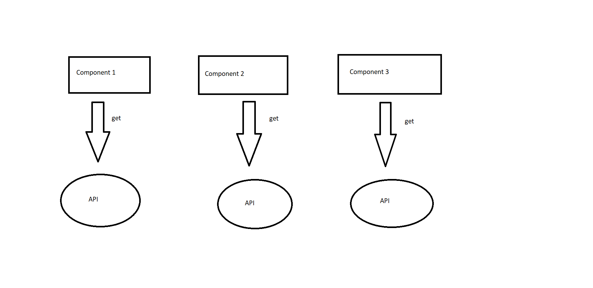
</p>

Practic fiecare componenta are in cadrul codului ei ceva de genul asta:

<p align="center">
    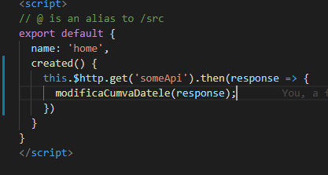
</p>

Acum sa scalam acest exercitiu de imaginatie la cateva zeci de componente, un numar realistic pentru un proiect real. Modelul acesta in care fiecare componenta cere datele in codul ei implica cateva probleme:

* Este nementenabil. Daca vreau sa modific cum se realizeaza un call trebuie sa navighez pana la componenta corecta, ceea nu mereu e asa usor de identificat
* Nu se poate realiza comunicarea de date intre componente. Daca componentele sunt _frati_ adica au aceasi componenta parinte atunci e destul de greu sa transmiti date sau evenimente de la o componenta la alta
* Daca api-urile sunt comune (2 componente trag date de la acelasi api, de exemplu am 2 interfete care afiseaza acelasi set de date cu elemente vizuale diferite, tabele, carduri, liste etc) atunci voi da requesturi degeaba. Datele intr-o componenta exista doar cat timp exista si componenta respectiva. Daca eu navighez de pe o pagina ce contine o componenta cu date in ea, atunci **datele respective trebuiesc reinitializate cand navighez inapoi pe pagina. Altfel spus trebuie sa dau callul HTTP din nou**

Aici este important de inteles faptul ca cererile HTTP **sunt cele mai costisitoare operatii pe care le poti face pe un site**. De ce? Pentru ca acestea nu mai depind de calculator, ci de viteza retelei, lucru pe care nu il poti controla. Dar ce poti controla este numarul acestora. Cu cat mai putine cu atat mai bine.

<p align="center">
    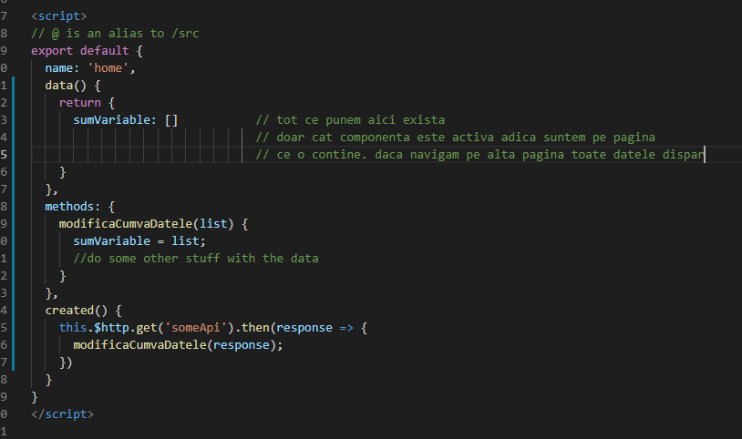
</p>

Aici intervin arhitecturile de tip _Flux_ introduse de Facebook. Acestea se rezuma la un simplu principiu:

**Datele de care am nevoie in pagina, pentru a afisa diverse informatii de exemplu, se numesc _sources of truth_. Toate sources of truth si toate functionalitatile ce tin de ele vor fi centralizate printr-un mecanism numit _store_.** 

Haideti sa contruim un exemplu de la 0. Sa presupunem ca avem o componenta care trage niste date de la un api si le afiseaza frumos intr-o lista:

<p align="center">
    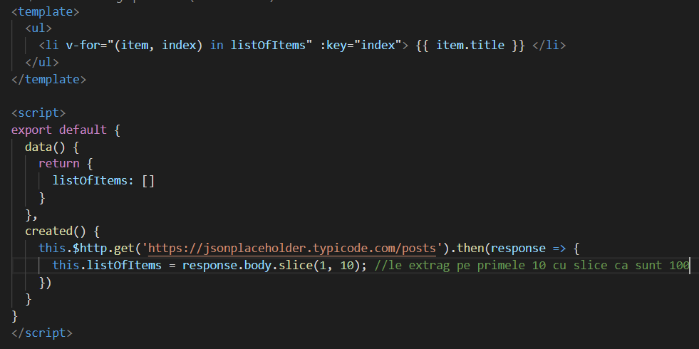
</p>

Haideti sa adaugam si o functie ce sterge ultimul element din lista:

<p align="center">
    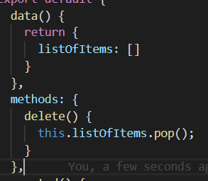
</p>

Acum avem o componenta cu cateva functionalitati complete. Dupa cum se observa componenta mea trage un set complet de date si afiseaza doar campurile _title_ ale obiectelor aduse de pe retea.

<p align="center">
    
</p>

Ce ne-am face daca ar trebui sa folosim o alta componenta dar care afiseaza campurile _body_ ale obiectelor aduse de pe retea, de asemenea cu functionalitatea de a sterge un element.

In mare parte ar trebui sa facem copy paste la cod. Sa dam ALT request pentru acelasi set de date, si sa se rescriem metoda ce da pop pe setul respectiv de date. (_author's note_ exista si alte metode in afara de vuex dar sunt asemanatoare ca si principii de baza).

Pentru situatii de genul acesta a fost creata arhitectura de tip _Flux_. Vuex este o librarie ce ne implementeaza principiile arhitecturii _Flux_. Daca ne uitam in proiect avem un nou folder numit _store_ in care avem un fisier _store.js_.

<p align="center">
    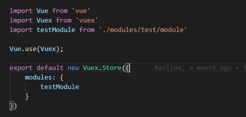
</p>

Principalul avantaj la Vuex esta ca pot sa imi structurez toate datele ca un arbore imens. Iar fiecare ramura este reprezentata de cate un **modul**. Un modul corespunde cu cate o sectiune din datele din aplicatie. De exemplu pentru api-ul _/posts_ as face un modul, iar pentur api-ul _/images_ as face **alt modul**.

Dar ce contine un modul? Aici intervine arhitectura. Haideti sa ne gandim la flowul normal al datelor noastre.

Se declara variabilele ce tin datele **->** datele sunt trase de pe retea **->** datele sunt asignate in variabile **->** variabilele sunt extrase in HTML si afisate in lista cu v-for

Pentru fiecare din acesti pasi avem in modul cate un fisier:

* _states.js_ **-** variabilele in care imi tin datele
* _getters.js_ **-** functii getter(ce returneaza o variabila) pentru a extrage variabilele. Nu este recomandat sa apelam direct state-urile cand avem nevoie de date ci sa folosim getteri.
* _mutations.js_ **-** mutatiile sunt modificari ce se aplica pe state-uri in mod **sincron**. De exemplu asignarea unei valori sau stergerea unui element dintr-o lista
* _actions.js_ **-** actiunile sunt modificari ce se aplica pe state-uri in mod **asincron** . Aici vor fi trecute in mare parte cererile HTTP de orice fel ar fi ele

De asemenea mai avem un _index.js_ ce importa datele din toate cele 4 fisiere si le uneste intr-un modul. 

Haideti sa le luam pe rand.

**_states.js_**

<p align="center">
    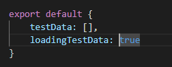
</p>

Observam ca se exporta un obiect cu toate variabilele pe care le vom folosi pentru acest set de date. Lista _testData_ este variabila pe care o vom apela mereu de acum cand vrem sa lucram cu datele de pe API. **Faptul ca acum variabila nu mai este declarata in interiorul componentei inseamna ca exista independent de componenta. Altfel spus datele din aceasta variabila vor exista chiar daca componentele ce folosesc variabila se distrug.** _loadingTestData_ este un boolean folosit pentru a marca daca datele inca se incarca. Acesta este folosit pentru spinnerul din componenta pe care il vom adauga.

**_getters.js_**

<p align="center">
    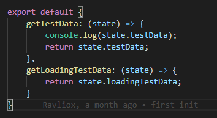
</p>

Observam ca getterii sunt doar functii ce returneaza variabilele declarate in _states.js_. De remarcat este parametrul lor (_state_):

```
    getTestData: (state) => {/*...*/}
```

Noi declaram acel state in functia de getter atunci cand o scriem, iar libraria de Vuex il va completa automat cu obiectul declarat in _states.js_. Altfel spus, cand declaram parametrul _state_ la getter vom avea acces la variabilele noastre.

**_mutations.js_**

<p align="center">
    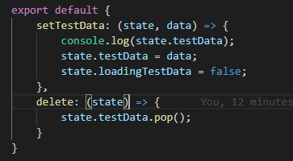
</p>

Mutatiile sunt functiile pe care de obicei le-am fi pus in _methods_ in componentele noastre. Dupa cum se observa avem un **setter**, adica o functie ce atribuie o valoare state-urilor noastre, si o functie de _delete_ in care sterg ultimul element din lista mea. Toate aceste modificari dupa cum se observa sunt sincrone, adica se executa instant. 

_P.S. Va puteti gandi la setteri si getteri ca la citire si scriere. Getteri citesc informatia dintr-o variabila, iar setterii scriu informatia in variabila_

**_actions.js_**

<p align="center">
    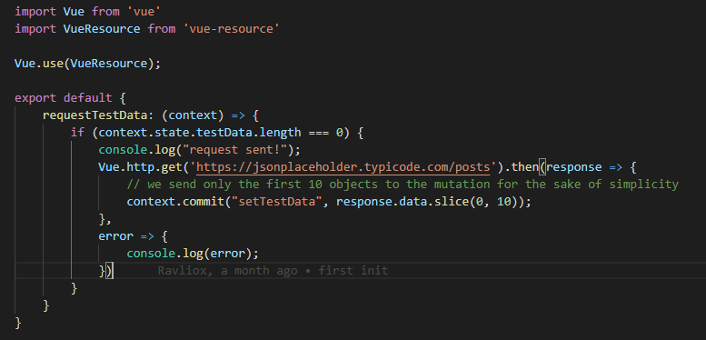
</p>

Aici am cererea HTTP care imi cere date. Daca as avea un request de tip POST de exemplu catre server tot aici ar fi pus. Dupa cum puteti observa este similar cu ce am fi pus in _created()_ in mod normal. Dar avem cateva diferente. In primul rand avem urmatoarea semnatura a functiei:

```
    requestTestData: (context) => {/*...*/} 
```

Haideti sa ne aducem aminte cum functiona cererea mea cat timp eram in componenta

```
created() {
    this.$http.get(url).then(data => {
        doSomethingWithData(data)
    })
}
```

Functia aceea _doSomethingWithData()_ era in cadrul obiectului _methods_ din componenta. In contextul vuex functiile pe care in mod normal le-am fi scris in _methods_ se afla in _mutations.js_. La getteri si la mutatii pasam obiectul _state_ pentru a extrage variabilele din _states.js_. In actiuni trebuie sa pasam **mutatiile** si facem asta prin obiectul _context_ ce reprezinta intreg modulul. Daca veti da console.log(context) in actiune veti vedea ca acesta este un obiect ce are acces la mutatii, stateuri, getteri si actiuni pentru modulul nostru. Astfel codul de mai sus se transform in:

```
    requestTestData: (context) => {
        Vue.http.get(url).then(data => {
            context.commit("doSomethingWithData", data);
        }
    }
```

_context.commit()_ este o functie ce apeleaza o mutatie din modul. Numele mutatiei este dat ca prim parametru, iar parametrii de dupa reprezinta parametrii mutatiei. De exemplu, mutatia setTestData are signatura rumatoare:

```
    setTestData: (state, data) => {/*...*/} 
```

_state_ este completat de catre vuex. _data_ sunt datele ce trebuie puse in stateurile noastre si e un parametru pe care il asteapta mutatia. Acesta este parametru este pasat prin al doilea parametru al functiei context.commit().

Pe langa acest lucru mai am si urmatoarea linie in actiunea mea:

```
    if (context.state.testData.length === 0) {}
```

Dupa cum am spus _context_ are acces si la state-urile din modulul nostru. Ce verific aici este daca lista mea de date are elemente in ea. Daca este goala, atunci trimite o cerere HTTP si populeaza-o folosind mutatia _setTestData()_. Daca nu este goala atunci nu fa nimic.

Totusi o intrebare ramane. Toate acestea sunt puse in folderul _store_ si datele/functiile mele sunt izolate de componente. Dar, cum le folosesc in cadrul componentelor? Cum fac legatura dintre HTML si toate chestiile astea?

Vuex ne pune la dispozitie niste functii ajutatoare. Daca ne uitam in VuexExample.vue:


<p align="center">
    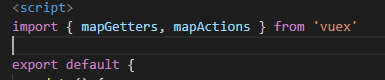
</p>

Aceste functii ne extrag functiile de care avem nevoie din modulul nostru de store. Haideti sa vedem cum se utilizeaza. Vom incepe cu geterii:

<p align="center">
    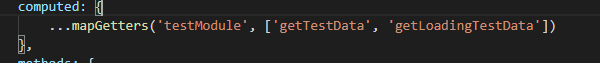
</p>

Sa incepem cu intrebarea evidenta: ce sunt alea 3 puncte. Daca avem:

```
    obj1 = {
        a: 1,
        b: 2
    }

    obj2 = {
        c: 3
    }

    obj3 = {
        ...obj1,
        ...obj2 
    }

```

atunci _obj3_ va fi egal cu

```
{
    a: 1,
    b: 2,
    c: 3
}
```

Cele 3 puncte se numesc operator _spread_ pentru ca distribuie proprietatile unui obiect in alt obiect. 
Ce se intampla in cazul nostru? Se extrag functiile din fisierul _getters.js_ din modulul _testModule_ si se introduc in componenta in obiectul **computed**. Ce inseamna asta mai pe scurt? Inseamna ca eu pot sa folosesc functiile acelea ca si cum ar fi scrise in componenta. O proprietate a functiilor scrise in _computed_ e ca pot sa le folosesc ca variabile:

<p align="center">
    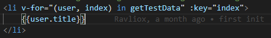
</p>

In mod normal in loc de _getTestData_ in v-for am fi folosit o lista declarata in data(). Dar acum putem folosi acest getter, si folosim direct datele din store.

Mai trebuie sa ne extragem ceva, si anume actiunea ce cheama datele. Noi am scris o functie in _actions.js_ dar nu am apelat-o nicaeri. Mai intai trebuie sa o introducem in componenta similar cum am facut cu getterii, doar ca de data asta in **methods**.

<p align="center">
    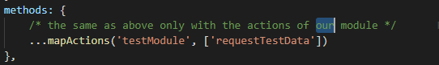
</p>

Dupa cum am spus acum putem folosi actiunea ca si cum ar fi scrisa la noi in componenta. Asa ca o vom apela exact unde am apela o cerere HTTP de genul in mod normal: in _created()_.

<p align="center">
    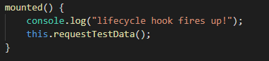
</p>

Pana acum au fost destul de multe informatii, prezentate destul de izolat una de alta, asa ca haideti sa reluam **tot _fluxul_ componentei de la inceput pana la sfarsit**.

1. In componenta in care dorim sa folosim datele se injecteaza metodele din modulul din store 

<p align="center">
    
</p>

<p align="center">
    
</p>

<p align="center">
    
</p>

2. Se apeleaza getterii unde avem nevoie de date:

<p align="center">
    
</p>

Daca lista este populata atunci v-forul va itera prin lista si va afisa ce e nevoie sa fie afisat. Daca este goala atunci nu se afisa nimic. Dar nu este o problema pentru ca pasul 2 se intampla simultan cu pasul 3. Daca lista este goala si actiunea este apelata atunci lista va aparea dupa cateva secunde, cand cererea http s-a terminat

3. Se apeleaza in mounted() sau in created() actiunea. Mounted si created servesc in mare parte aceeasi functie:

<p align="center">
    
</p>

4. In momentul acesta operatiile se muta din componenta in store, si fluxul continua in _actions.js_ in _requestTestData()_

<p align="center">
    
</p>

In momentul acesta se intampla o verificare. Daca actiunea a mai fost apelata o data (sa zicem ca eram pe pagina cu componenta am plecat si ne-am reintors, astfel s-a apelat actiunea in mounted()_ de 2 ori) atunci noi am trimis deja cererea HTTP. Si putem sa ne dam seama de acest lucru daca lista noastra de date are elemente (daca nu are lungimea ei e 0). Daca este plina atunci actiunea noastra nu va face nimic, iar getterii de la pasul 2 pur si simplu vor returna lista plina de date.

Daca lista este goala, atunci actiunea trimite cererea HTTP, iar daca primeste un raspuns pozitiv cheama _context.dispatch("setTestData", data)_ si se trece la pasul 5.

5. (nu se ajunge aici daca cererea HTTP s-a mai dat o data) Am ajuns in _mutations.js_ 

<p align="center">
    
</p>

Se apeleaza _setTestData_ cu datele primite de actiunea din cererea HTTP. Se ia state-ul din _state.js_ si se populeaza cu informatiile primite de la actiune. 

6. (nu se ajunge aici daca cererea HTTP s-a mai dat o data) Getterii de la pasul 2 au fost chemati si au returnat o lista goala pentru ca nu s-a dat cererea HTTP pana acum. Getterii sunt speciali pentru ca ei sunt reactive, adica daca lista pe care o returneaza, in cazul de fata _testData_ se modifica atunci si ei se vor reapela si vor returna lista completa.

7. (se intampla imediat dupa pasul 2 daca cererea HTTP s-a mai dat o data) v-for-ul este randat cu informatiile trase din API

<p align="center">
    
</p>

<p align="center">
    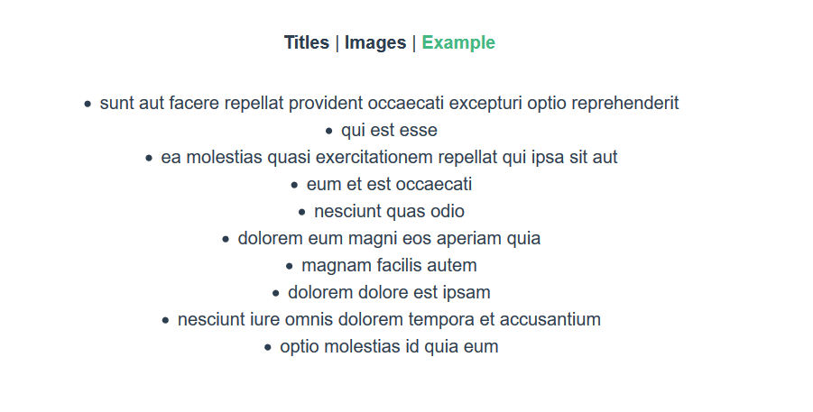
</p>

# Task

Acest api [https://jsonplaceholder.typicode.com/photos](https://jsonplaceholder.typicode.com/photos) contine o lista de obiecte ce descriu niste poze. In aplicatia voastra aveti 3 pagini: una de exemplu, una numita _Titles_ si una numita _Images_. 

Creati un **NOU** modul in store care sa indeplineasca urmatoarele cerinte:

* Pe pagina _Titles_ afisati intr-o lista titlurile imaginilor
* Pe pagina _Images_ afisati intr-o lista imaginile in sine
* Datele trebuie cachuite. Nu trebuie sa se dea requestul de mai multe ori
* Scrieti o functie care sa stearga ultima imagine/titlu din lista (doar in aplicatie, **NU** trebuie dat request la server)
